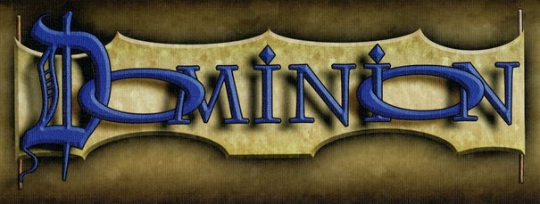

# DOMINION

### Description:
This is a web application that simulates the card game Dominion published by Rio Grande Games.

### Team Members:
- Heather Conklin ([heath3conk](https://github.com/heath3conk)): VP of Production and CTO. Taxonomist of ideal cake/beverage consumption.
- James O'Neal ([jamesponeal](https://github.com/jamesponeal)): VP of Engineering and CIO. Associate whiskey drinker and cake eater.

### Team Guidelines:
- Checkins as needed.
- If you're stuck, ask for help.
- Trello board will be used to track tasks and progress.
- Whiskey and chocolate cake breaks are encouraged.

